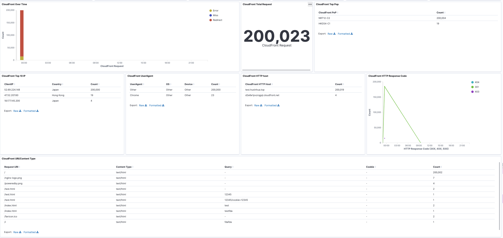

# Kibana Visualization Dashbard for CloudFront and WAF Logs

## Ingest CloudFront logs to Elasticsearch

**Sample Logstash configuration to Ingest CloudFront logs, from S3 bucket to Elasticsearch**
```
#cloudfront.conf
input {
  s3 {
    bucket => "wa-demo-us-east-1-alblogs"
    prefix => "cflogs"
    region => "us-east-1"
  }
}

#filter
filter {
  grok { 
    match => { "message" => "(?<date>%{YEAR:year}-%{MONTHNUM:month}-%{MONTHDAY:monthday})\t%{TIME:time}\t(?<x_edge_location>[\w\-]+)\t(?:%{NUMBER:sc_bytes:int}|-)\t%{IPORHOST:c_ip}\t%{WORD:cs_method}\t%{HOSTNAME:cs_host}\t%{NOTSPACE:cs_uri_stem}\t%{NUMBER:sc_status:int}\t%{NOTSPACE:referrer}\t%{NOTSPACE:User_Agent}\t%{NOTSPACE:cs_uri_query}\t%{NOTSPACE:cookies}\t%{WORD:x_edge_result_type}\t%{NOTSPACE:x_edge_request_id}\t%{HOSTNAME:x_host_header}\t%{WORD:cs_protocol}\t%{NUMBER:cs_bytes:int}\t%{NUMBER:time_taken:float}\t%{NOTSPACE:x_forwarded_for}\t%{NOTSPACE:ssl_protocol}\t%{NOTSPACE:ssl_cipher}\t%{WORD:x_edge_response_result_type}\t%{NOTSPACE:cs_protocol_version}\t%{NOTSPACE:fle_status}\t%{NOTSPACE:fle_encrypted_fields}\t%{NUMBER:c_port:int}\t%{NOTSPACE:time_to_first_byte}\t%{WORD:x_edge_detailed_result_type}\t%{NOTSPACE:sc_content_type}\t%{NOTSPACE:sc_content_len}\t%{NOTSPACE:sc_range_start}\t%{NOTSPACE:sc_range_end}" 
    }
  }

  mutate {
    add_field => [ "listener_timestamp", "%{date} %{time}" ]
  }

  date {
    match => [ "listener_timestamp", "yyyy-MM-dd HH:mm:ss" ]
    target => "@timestamp"
  }

  geoip {
    source => "c_ip"
  }

  useragent {
    source => "User_Agent"
    target => "useragent"
  }

  mutate {
    remove_field => ["date", "time", "listener_timestamp", "cloudfront_version", "message", "cloudfront_fields", "User_Agent"]
  }
}

output {
  elasticsearch {
    hosts => ["localhost:9200"]
    index => "cloudfront-logs-%{+YYYY.MM.dd}"
#    template => "/home/ubuntu/cloudfront.template.json"
  }
}

```

## Ingest WAF logs to Elasticsearch

**Sample Logstash configuration to Ingest WAF logs, from S3 bucket to Elasticsearch**
> - Also you can use Kinesis Firehose to deliver WAF logs directly to Amazon Elasticsearch
>
> - But with logstash, you can add Geolocation information to client IP, when ingesting logs to Elasticsearch

```
#cloudfront.conf
input {
  s3 {
    bucket => "wa-demo-us-east-1-alblogs"
    prefix => "waflogs2020"
    region => "us-east-1"
    codec => "json"
  }
}

#filter
filter {
  geoip {
    source => "[httpRequest][clientIp]"
  }
}


output {
  elasticsearch {
    hosts => ["localhost:9200"]
    index => "awswaf-%{+YYYY.MM.dd}"
#    template => "/home/ubuntu/cloudfront.template.json"
  }
}

```

## Configure Kibana

### Add index template for CloudFront logs

```
## PUT _index_template/template1

{
  "index_templates" : [
    {
      "name" : "template1",
      "index_template" : {
        "index_patterns" : [
          "cloudfront-logs-*"
        ],
        "template" : {
          "mappings" : {
            "properties" : {
              "geoip" : {
                "dynamic" : true,
                "properties" : {
                  "ip" : {
                    "type" : "ip"
                  },
                  "latitude" : {
                    "type" : "float"
                  },
                  "location" : {
                    "type" : "geo_point"
                  },
                  "longitude" : {
                    "type" : "float"
                  }
                }
              }
            }
          }
        },
        "composed_of" : [ ]
      }
    }
  ]
}

```


### Add index template for WAF logs
```
## PUT /_template/waf

{
  "waf" : {
    "order" : 0,
    "index_patterns" : [
      "awswaf-*"
    ],
    "settings" : { },
    "mappings" : {
      "properties" : {
        "geoip" : {
          "dynamic" : true,
          "properties" : {
            "ip" : {
              "type" : "ip"
            },
            "latitude" : {
              "type" : "half_float"
            },
            "location" : {
              "type" : "geo_point"
            },
            "longitude" : {
              "type" : "half_float"
            }
          }
        }
      }
    },
    "aliases" : { }
  }
}

```


## Create Kibana Visualization and Dashboard

### Check Template setting


### Import visualization and dashboard
Import [WAF&CloudFront-export.ndjson](./WAF&CloudFront-export.ndjson) to Kibana Saved Objects

### Sample Dashboard




